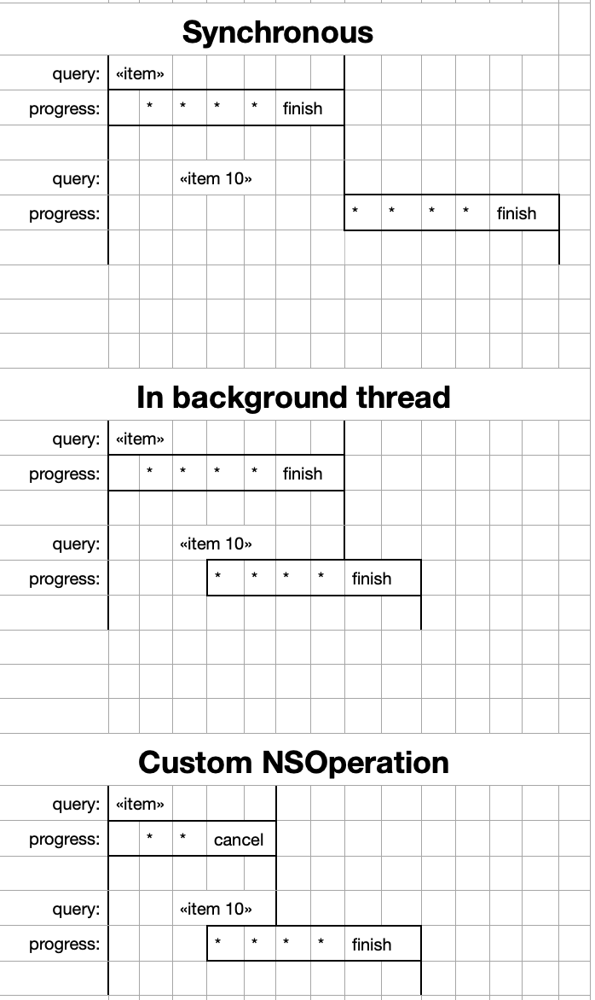

# data_search
## Data search (filter) with 3 options:

- Option 1: search synchronous in main thread.
Blocks thread and we cannot modify search query until the search in process.

- Option 2: search concurrency in background thread.
We can modify search query, but the previous operation will not be canceled and will work until the end.

- Option 3: search concurrency in background thread with custom NSOperation.
We can modify search query, and previous operation will be canceled.

